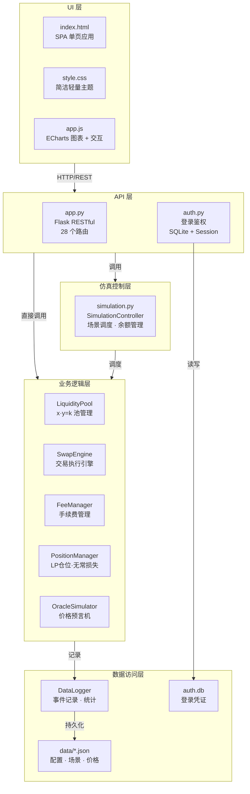
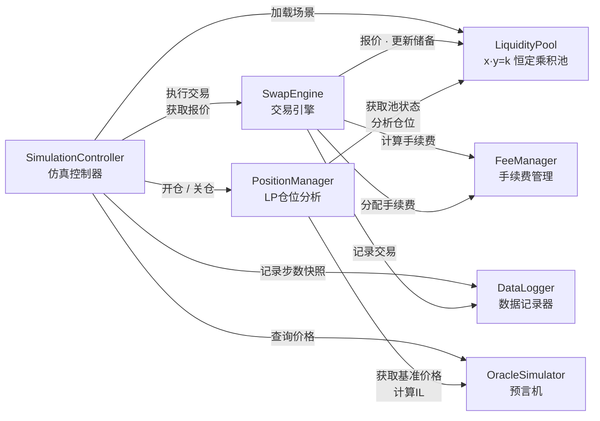
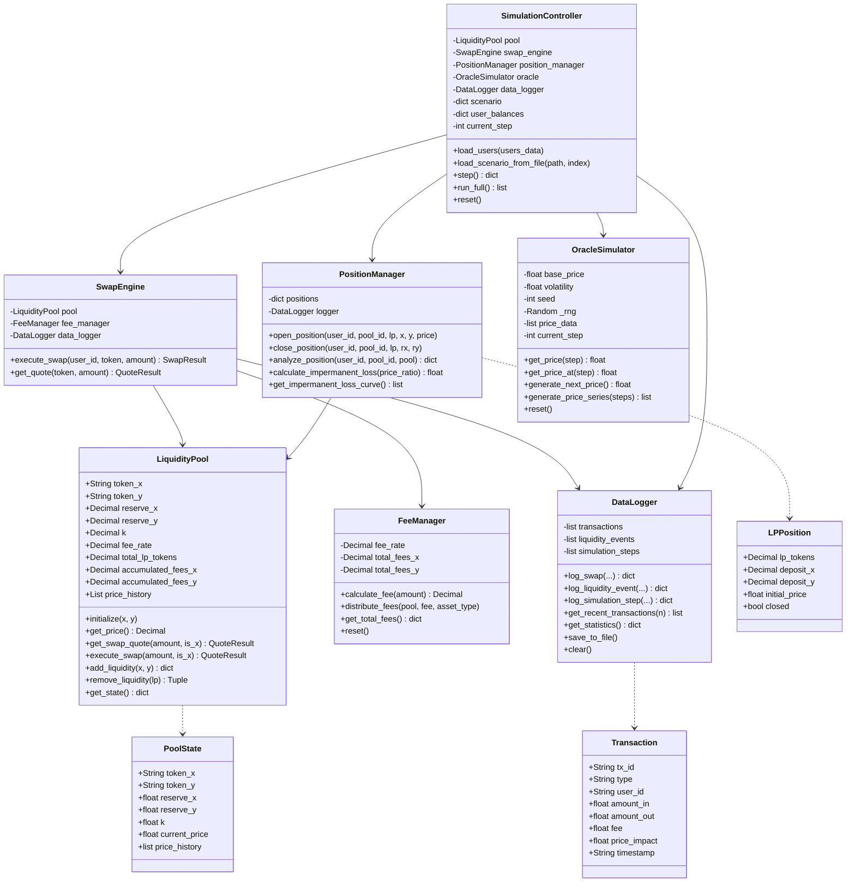
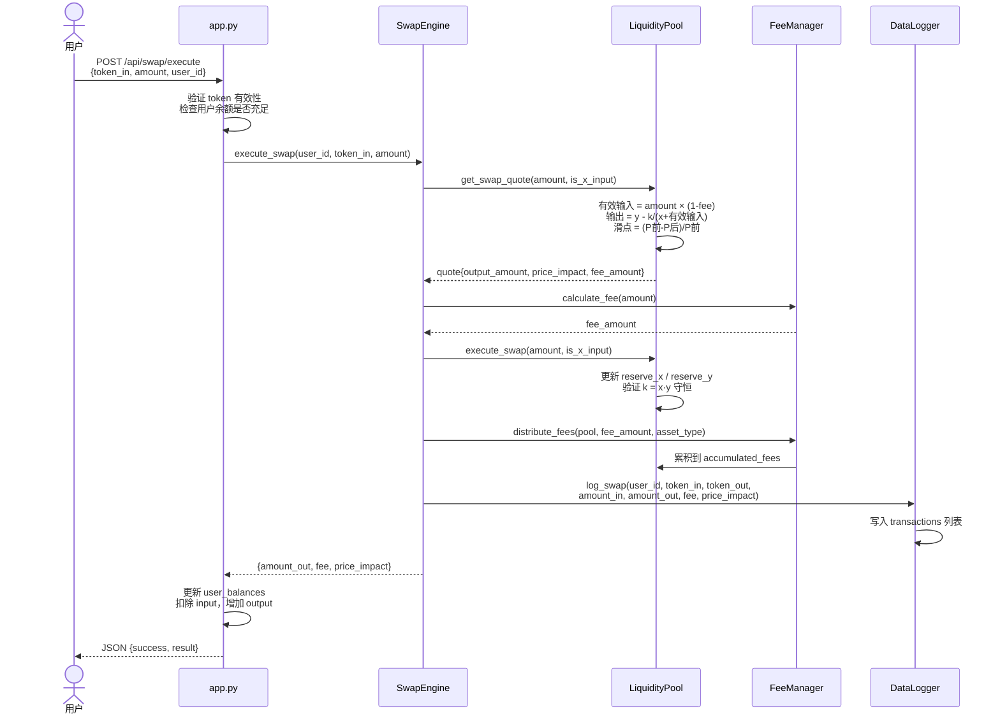

# AMM 交易所仿真系统 — 技术报告

> **课程名称**：金融软件工程实验  
> **学期**：2025-2026 学年 第二学期  
> **项目主题**：去中心化金融（DeFi）核心逻辑仿真 — AMM 自动做市商  
> **提交日期**：2026 年 6 月

---

## 1. 问题定义

### 1.1 模拟的 DeFi 机制

本系统模拟**自动做市商（Automated Market Maker, AMM）**，这是去中心化金融（DeFi）最核心的基础设施之一。与传统订单簿交易所不同，AMM 通过数学公式自动撮合交易，无需对手方即可完成资产兑换。

具体模拟的机制包括：

- **恒定乘积做市（$x \cdot y = k$）**：Uniswap V2 的核心算法，通过维持流动性池中两种资产数量的乘积恒定来实现自动定价。
- **代币交换（Swap）**：用户向池中存入一种代币，按公式计算可提取的另一种代币数量，含手续费扣除。
- **流动性提供（Liquidity Provision）**：LP 向池中存入两种资产，系统自动按池子比例计算最优配对量（Uniswap V2 风格），超出部分自动裁切，按实际使用量铸造 LP Token。
- **手续费分配**：每笔交易按固定费率（0.3%）扣除手续费，累积在池中作为 LP 的收益。
- **无常损失（Impermanent Loss）**：LP 因资产价格变化相对于简单持有（HODL）产生的暂时性账面亏损。
- **预言机价格**：外部市场价格基准，用于计算无常损失和套利参考。

### 1.2 解决的金融问题

AMM 解决了传统订单簿交易所的三个核心问题：

1. **流动性碎片化**：传统交易所需要买卖双方同时存在才能成交。AMM 通过数学公式将流动性集中在一个池中，任何时刻都可以交易。
2. **做市门槛**：传统做市需要专业知识和大量资本。AMM 允许任何人存入资产成为流动性提供者，按份额分享手续费收益。
3. **价格发现**：AMM 的价格由池中资产比例决定，交易量越大价格偏离越多（滑点），这自然地反映了供需关系。

### 1.3 为什么用离线仿真

DeFi 协议的价值不在于"是否上链"，而在于其**透明、可编程、无需许可的金融逻辑**。通过离线仿真：

- 排除了区块链网络延迟、Gas 费等干扰因素
- 可以精确控制实验条件（价格走势、用户行为）
- 实现比特级可复现（固定随机种子）
- 便于批量实验和对比分析

---

## 2. 数学模型

### 2.1 恒定乘积做市公式

AMM 的核心是一个不变式：

$$x \cdot y = k$$

其中 $x$ 为池中 Token X（ETH）的数量，$y$ 为 Token Y（USDC）的数量，$k$ 为恒定乘积。池中资产的现货价格为：

$$P = \frac{y}{x}$$

### 2.2 Swap 输出量推导

假设用户存入 $\Delta x$ 数量的 ETH，期望获得 $\Delta y$ 数量的 USDC。手续费率为 $f$（0.3%），则：

实际用于兑换的数量为 $\Delta x \cdot (1 - f)$。

交易后的恒定乘积：

$$(x + \Delta x \cdot (1 - f)) \cdot (y - \Delta y) = x \cdot y = k$$

解得输出量：

$$\Delta y = y - \frac{k}{x + \Delta x \cdot (1 - f)} = \frac{\Delta x \cdot (1 - f) \cdot y}{x + \Delta x \cdot (1 - f)}$$

交易执行后的新价格为：

$$P_{new} = \frac{y - \Delta y}{x + \Delta x \cdot (1 - f)}$$

### 2.3 滑点（Price Impact）计算

滑点定义为交易前后现货价格的变化率：

$$\text{Price Impact} = \frac{P_{before} - P_{after}}{P_{before}} = 1 - \frac{P_{after}}{P_{before}}$$

代入 $P = y/x$ 和 $P_{new}$ 可得：

$$\text{Price Impact} = \frac{\Delta x \cdot (1-f)}{x + \Delta x \cdot (1-f)}$$

交易量 $\Delta x$ 相对于池子深度 $x$ 越大，滑点越高。这正是需求文档 FR-09 "大额交易冲击模拟"的数学基础。

### 2.4 无常损失公式推导

假设 LP 在价格为 $P_0$ 时存入 $x_0$ ETH 和 $y_0$ USDC（$P_0 = y_0/x_0$）。

如果价格变为 $P_1 = r \cdot P_0$（$r$ 为价格变化倍数），则：

LP 在池中的资产价值为：
$$V_{LP} = x_1 \cdot P_1 + y_1 = 2 \cdot \sqrt{k \cdot P_1}$$

如果 LP 选择不提供流动性而简单持有（HODL），资产价值为：
$$V_{HODL} = x_0 \cdot P_1 + y_0$$

无常损失即为两者的相对差值：
$$IL = \frac{V_{LP} - V_{HODL}}{V_{HODL}} = \frac{2\sqrt{r}}{1+r} - 1$$

关键性质：
- $r = 1$（价格不变）：$IL = 0$，无常损失为零
- $r = 2$（价格翻倍）：$IL \approx -5.72\%$
- $r = 5$（价格五倍）：$IL \approx -25.46\%$
- $r = 0.5$（价格减半）：$IL \approx -5.72\%$（对称）

无常损失始终为负（或零），表示 LP 的收益总是低于或等于简单持有。手续费收入是对无常损失的补偿。

### 2.5 LP Token 铸造公式

**首次存入**（池子为空时）：
$$LP_{total} = \sqrt{x_{deposit} \cdot y_{deposit}}$$

**非首次存入**（池子非空时，采用 Uniswap V2 风格自动修正）：
系统根据当前池子比例自动计算最优配对量，取 $\min(desired, optimal)$：

$$y_{optimal} = x_{desired} \cdot \frac{y_{reserve}}{x_{reserve}}$$

若用户多给了 Y，则按 X 为基准裁切 Y；若多给了 X，则按 Y 为基准裁切 X。实际使用的数量为：

$$(x_{used}, y_{used}) = \begin{cases} (x_{desired}, y_{optimal}) & \text{if } y_{desired} \geq y_{optimal} \\ (x_{optimal}, y_{desired}) & \text{if } x_{desired} \geq x_{optimal} \end{cases}$$

LP Token 铸造量基于实际使用量计算：
$$LP_{new} = LP_{total} \cdot \frac{x_{used}}{x_{reserve}}$$

移除流动性时按 LP Token 份额返还：
$$x_{return} = \frac{LP_{burn}}{LP_{total}} \cdot x_{reserve}$$
$$y_{return} = \frac{LP_{burn}}{LP_{total}} \cdot y_{reserve}$$

---

## 3. 系统架构

### 3.1 分层架构设计

系统采用四层分层架构，层间通过明确接口交互，高内聚低耦合：



> **图 1：系统分层架构图** — 四层架构：UI 层 → API 层 → 仿真控制层 → 业务逻辑层 → 数据访问层。

### 3.2 模块划分与依赖关系



> **图 2：核心模块依赖与数据流图** — 7 个模块的调用关系。箭头方向表示"依赖于/调用"。

| 模块 | 文件 | 职责 | 耦合 |
|------|------|------|------|
| **LiquidityPool** | `core/liquidity_pool.py` | 管理 $x \cdot y = k$ 池状态、增删流动性、报价 | 被 SwapEngine/SimulationController 调用 |
| **SwapEngine** | `core/swap_engine.py` | 执行代币交换，协调 Pool、FeeManager、DataLogger | 调用 Pool + FeeManager + DataLogger |
| **FeeManager** | `core/fee_manager.py` | 手续费计算、累积、分配 | 被 SwapEngine 调用 |
| **PositionManager** | `core/position_manager.py` | LP 仓位跟踪、无常损失计算、HODL 对比 | 被 SimulationController 调用 |
| **OracleSimulator** | `core/oracle_simulator.py` | 外部价格数据（历史回放 / 随机漫步） | 被 SimulationController 调用 |
| **DataLogger** | `core/data_logger.py` | 交易/流动性/仿真步骤的结构化日志记录 | 被所有模块调用 |
| **SimulationController** | `core/simulation.py` | 场景加载、步进执行、用户余额管理 | 协调所有业务模块 |

### 3.3 核心类与数据结构



> **图 3：核心类图** — 7 个主要类 + 3 个数据结构。实线箭头表示"持有引用"，虚线箭头表示"产生/返回"。每个类标注了核心属性和方法，与概要设计文档 §2.2 的核心模块划分一一对应。

### 3.4 Swap 事件流

代币交换是系统最核心的业务流程，涉及 5 个模块的协同：



> **图 4：Swap 时序图** — 完整展示一次代币交换经过的 7 个阶段。与概要设计文档 §3.1 的 Swap 流程设计完全一致。

### 3.5 数值精度设计

核心计算全部使用 Python 的 `Decimal` 类型，精度设为 50 位：

```python
from decimal import Decimal, getcontext
getcontext().prec = 50
```

只在 API 边界（JSON 序列化）和前端展示时转换为 `float`。这确保了需求文档 QR-01 "数值精度高（避免浮点误差）"和 QR-10 "极端冲击下的数值稳定性"。

---

## 4. 仿真设计

### 4.1 时间推进方式

系统采用**离散事件步进仿真**：

- 每个场景定义总步数 `duration_steps`（如 50 步）
- 每步可包含多个事件（swap / add_liquidity / remove_liquidity）
- 事件按 `step` 字段分配到对应步数

支持两种执行模式：
- **单步执行**：每步执行后暂停，适合观察中间状态
- **完整运行**：自动执行全部步数，适合批量实验

### 4.2 用户行为建模

定义 5 类仿真用户，各有不同的初始资产和行为特征：

| 用户 | 类型 | ETH | USDC | 行为特征 |
|------|------|-----|------|----------|
| Alice | trader | 50 | 500,000 | 中等频率，中等规模交易 |
| Bob | lp_provider | 200 | 400,000 | 提供流动性，关注无常损失 |
| Charlie | arbitrageur | 100 | 1,000,000 | 高频套利交易 |
| Diana | researcher | 10 | 50,000 | 小规模试验性交易 |
| Eve | whale | 500 | 2,000,000 | 大额交易，用于冲击测试 |

### 4.3 场景设计

4 个仿真场景覆盖不同的实验目的：

| 场景 | 步数 | 核心事件 | 实验目的 |
|------|------|----------|----------|
| 基础交易 | 50 | 10 个事件（8 swap + 1 add + 1 remove） | 验证基本功能完整性 |
| 大额冲击 | 20 | 4 笔大额 swap（30%-50% 池深） | 观察价格冲击和滑点 |
| LP 提供者 | 30 | 7 个事件（3 swap + 2 add + 2 remove） | 分析无常损失和 LP 收益 |
| 套利场景 | 40 | 12 笔高频 swap | 观察价格回归和套利效果 |

### 4.4 随机性控制

所有随机行为由 `random.Random(42)` 控制，确保：

- 预言机随机漫步可完全复现
- 同一场景多次运行结果比特级一致
- 满足需求文档 QR-08 "实验可复现性"

预测机数据可通过 `scripts/fetch_prices.py` 从 Uniswap 获取真实历史价格，替代随机漫步。

---

## 5. 实验与验证

### 5.1 基础功能测试

35 个单元测试覆盖全部 6 个核心模块，所有用例通过：

```
tests/test_core.py:
  TestLiquidityPool (13 tests):
    initialize / zero raises / swap quote ETH→USDC / swap quote USDC→ETH
    invalid amount raises / exceeds liquidity / execute updates reserves
    price impact increases with size / constant product maintained
    add proportional / auto-correct ratio / remove / remove all raises

  TestSwapEngine (2 tests): execute full flow / get quote
  TestFeeManager (4 tests): calculate / distribute / totals / reset
  TestPositionManager (6 tests): IL 0×/2×/5×/0.5× / curve data / open+close
  TestOracleSimulator (5 tests): load / step access / generate / reproducibility / reset
  TestDataLogger (5 tests): swap log / liquidity log / stats / clear / multiple events
```

### 5.2 极端场景测试

**大额冲击场景**（鲸鱼卖出 30-50% 池子储备的 ETH）：

| 指标 | 初始值 | 最终值 | 变化 |
|------|--------|--------|------|
| ETH 储备 | 100.0 | 134.68 | +34.68% |
| USDC 储备 | 200,000 | 148,494.69 | -25.75% |
| AMM 价格 | $2,000 | $1,102.53 | **-44.87%** |

结果显示：当卖出量达到池子深度的 50% 时，价格冲击接近 -45%，远大于现货市场的线性预期。这验证了恒定乘积 AMM 在大额交易时的高滑点特性。

**价格冲击 vs 交易规模实验**（基于基础交易场景）：

| 交易量（ETH） | 占池深比例 | 滑点 |
|-------------|-----------|------|
| 1 | 1% | 0.99% |
| 2 | 2% | 1.96% |
| 5 | 5% | 4.75% |
| 20 | 20% | 16.62% |
| 50 | 50% | 33.27% |

滑点随交易规模非线性增长，当交易量达到池子深度的一半时，滑点达到约 33%。

### 5.3 对比分析

**四种场景横向对比**（CLI 模式输出）：

| 场景 | 步数 | 交易数 | 总成交量 | 手续费 | 价格变化 |
|------|------|--------|----------|--------|----------|
| 基础交易 | 50 | 8 | $60,033.50 | $180.10 | -10.44% |
| 大额冲击 | 20 | 4 | $100,120.00 | $300.36 | **-44.87%** |
| LP 提供者 | 30 | 3 | $20,005.00 | $60.02 | +8.40% |
| 套利 | 40 | 12 | $33,025.00 | $99.08 | -11.34% |

**分析结论**：
1. **大额冲击场景**价格变化最大（-44.87%），验证了低流动性池对大额交易的脆弱性。
2. **LP 提供者场景**价格反而上涨（+8.40%），因为注入 ETH 流动性增加了池中 ETH 储备量。
3. **套利场景**虽然交易次数最多（12 次），但每笔规模小，价格影响反而比大额冲击小得多。

### 5.4 无常损失 vs 价格变化

| 价格倍数 | 无常损失 |
|----------|----------|
| 0.1× | -42.50% |
| 0.5× | -5.72% |
| 1.0× | 0.00% |
| 2.0× | -5.72% |
| 5.0× | -25.46% |
| 10.0× | -42.50% |

无常损失对价格变化对称，且始终为负。LP 需要手续费收入超过无常损失才能获得净收益。

### 5.5 参数敏感性分析：费率对交易结果的影响

固定基础交易场景（50 步），分别设定费率为 0.1%、0.3%、1.0%，运行 `python main.py --compare`：

| 费率 | 手续费收入 | 成交量 | 平均滑点 | 最终价格 | 价格变化 |
|------|-----------|--------|----------|----------|----------|
| 0.1% | 60.0335 | 60,033.50 | -0.0104% | 1,790.58 | -10.47% |
| 0.3% | 180.1005 | 60,033.50 | -0.0104% | 1,791.20 | -10.44% |
| 1.0% | 600.3350 | 60,033.50 | -0.0102% | 1,793.38 | -10.33% |

**分析结论**：
1. **手续费收入与费率成正比**：1.0% 费率的手续费收入正好是 0.1% 的 10 倍，符合理论预期。
2. **成交量恒定**：三种费率下成交量完全相同（60,033.50），因为场景中交易量是预设参数，不受费率影响。
3. **价格影响差异微小**：费率越高，实际进入池子的有效交易量越小，故价格偏离略小（-10.33% vs -10.47%）。差异在 0.15% 以内，说明在 50 步尺度下费率不是价格的主要决定因素。
4. **LP 收益权衡**：高费率带来更多手续费收入，但可能降低交易频率（本实验预设场景未体现，可在用户行为建模中扩展）。

---

## 6. 团队分工与反思

### 6.1 分工

| 姓名 | 负责内容 | 占比 |
|------|----------|------|
| 黎俊 | **核心业务逻辑层** — `core/` 全部 8 个模块 | 30% |
| 杨浚颢 | **后端 API + 登录** — `app.py`、`auth.py`、`run.py` | 25% |
| 吴青润 | **前端界面** — `templates/`、`static/` 全部文件 | 25% |
| 李金承 | **测试 + CLI + 爬虫 + 文档** | 20% |

### 6.2 项目难点

1. **数值精度**：Python 浮点数在计算 $x \cdot y = k$ 时有累积误差。解决方案：全部核心计算使用 `Decimal` 并设精度 50 位，API 边界才转 float。

2. **手续费与恒定乘积的耦合**：扣除手续费后有效输入量变化，导致 $k$ 值实际不恒定。解决方案：手续费不改变 $k$，而是累积到 `accumulated_fees` 字段，在 LP 退出时按份额分配。

3. **滑点与交易规模的量化关系**：需要通过实验验证理论公式 $\text{Impact} = \Delta x \cdot (1-f) / (x + \Delta x \cdot (1-f))$ 在极端值下的正确性。

4. **仿真可复现性**：使用独立 `random.Random(42)` 而非全局随机模块，确保每次运行结果比特级一致。

### 6.3 改进方向

1. **多池支持**：当前仅实现单交易对（ETH/USDC），可扩展为多池架构，支持跨池套利。
2. **动态费率**：实现 Uniswap V3 的集中流动性模型，根据波动率动态调整手续费。
3. **借贷协议集成**：在 AMM 仿真基础上加入借贷和清算逻辑。
4. **性能优化**：批量仿真场景时可用 NumPy 向量化加速，支持数十万步的大规模回测。
5. **更多价格模型**：预言机可接入跳跃扩散模型（加入黑天鹅事件模拟），更真实模拟极端行情。

---

## 参考文献

1. Adams, H., Zinsmeister, N., et al. "Uniswap v2 Core." 2020.
2. Angeris, G., et al. "An Analysis of Uniswap Markets." *Cryptoeconomic Systems*, 2021.
3. Xu, J., et al. "SoK: Decentralized Exchanges (DEX) with Automated Market Maker (AMM) Protocols." *ACM Computing Surveys*, 2023.
